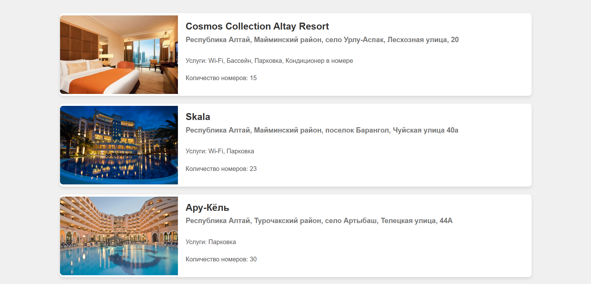
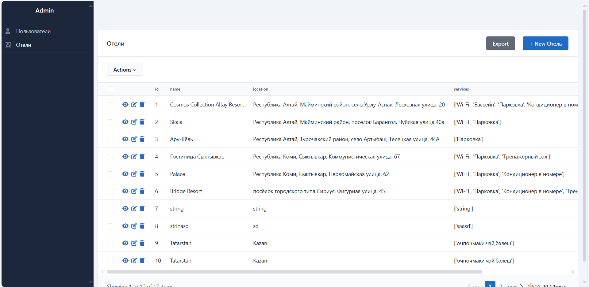
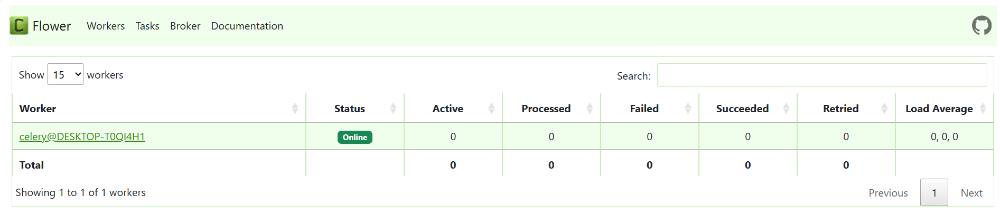

# About
This is a backend project for a hotel booking system built with **FastAPI**, **PostgreSQL**, **Redis** for caching, and **Celery** for background task processing. It uses **Pydantic** for data validation, **SQLAlchemy** for ORM, **Jinja** for templating, **SQLAdmin** for admin interface, **Alembic** for database migrations, and **Flower** for monitoring Celery tasks.

# Project structure

```
├───admin
├───bookings
├───dao
├───hotels
├───images
├───pages
├───rooms
├───static
│   ├───css
│   └───images
├───tasks
├───templates
└───users
```

# Features
* FastAPI: A modern, fast (high-performance) web framework for building APIs with Python.
* PostgreSQL: Used as the main relational database for storing data.
* Redis: Caching service to speed up responses for frequently requested data.
* Celery: A distributed task queue for handling background tasks asynchronously.
* Flower: Real-time web interface for monitoring Celery workers and tasks.
* Pydantic: For data validation and parsing, ensuring data integrity.
* SQLAlchemy: ORM for interacting with the PostgreSQL database.
* Alembic: Used for database migrations to manage schema changes over time.
* Jinja: Templating engine used for rendering HTML templates.
* SQLAdmin: Provides an admin interface for managing application data through the web.

# Frontend


# Routes (Swagger)


# Admin Panel


# Task Panel


# Installation

1. Clone the repository:
    ```
    git clone https://github.com/rentbest/fastapi_booking.git
    cd fastapi_booking
    ```

2. Create and activate a virtual environment:
    ```
    python -m venv .venv
    source .venv/bin/activate  # On Windows: .venv\Scripts\activate
    ```

3. Install dependencies:
    ```
    pip install -r requirements.txt
    ```

4. Set up the .env file with the necessary environment variables for database, Redis, and other settings.

# Running the Application

1. Start Redis and PostgreSQL services:
    ```
    # For Redis
    redis-server

    # For PostgreSQL, ensure it's running and accessible
    ```

2. Apply database migrations with Alembic:
    ```
    alembic upgrade head
    ```

3. Run the FastAPI server:
    ```
    uvicorn app.main:app --reload
    ```

4. Start Celery worker:
    ```
    celery -A app.tasks.celery:celery worker --loglevel=info
    ```

5. (Optional) Start Flower to monitor Celery tasks:
    ```
    celery -A app.tasks.celery:celery flower --port=5555
    ```
    Flower provides a real-time interface for viewing the status of Celery tasks and workers at http://localhost:5555.

6. Access the SQLAdmin interface at /admin by running the app.


